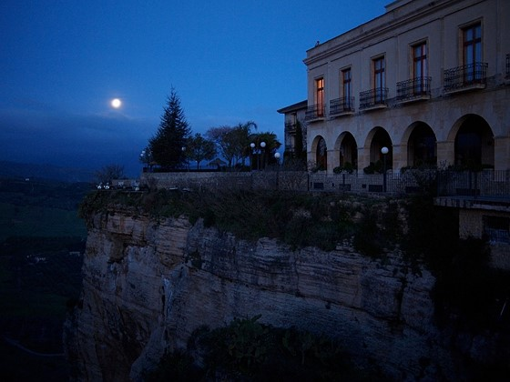
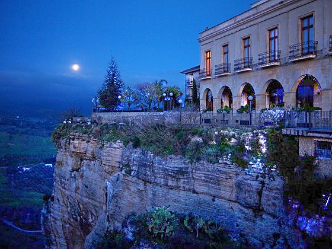

# Low-light Image Enhancement
## Overview
This project focuses on enhancing low-light images using classical image processing and Retinex-based methods. It aims to improve visual quality and restore useful information for downstream computer vision tasks.

## Background
When one captures images in low-light conditions, the images often suffer from low visibility. Besides degrading the visual aesthetics of images, this poor quality may also significantly degenerate the performance of many computer vision and multimedia algorithms that are primarily designed for high-quality inputs.

  
  

  (a) before enhancement &emsp;&emsp;&emsp;&emsp;&emsp;&emsp;&emsp;&emsp;&emsp; (b) after enhancement

  <b>Figure 1:</b> Low-light images before and after enhancement.

## Dataset
A small dataset consisting of 5 low-light images is used for evaluation.

## Methods
The following image enhancement methods are implemented:
1. Gray-level Histogram Equalization (HE)
Enhances global contrast by redistributing intensity values.
2. Contrast Limited Adaptive Histogram Equalization (CLAHE)
Improves local contrast while preventing over-amplification of noise.
3. Retinex model based algorithm: LIME
A Retinex-based method that estimates illumination and enhances visibility.

## Evaluation Metric
- Lightness Order Error (LOE)
Measures the preservation of relative lightness ordering in the enhanced image.

## Results

## References
> [1] Ali M Reza. Realization of the contrast limited adaptive histogram equalization (clahe) for real-time image enhancement. Journal of VLSI signal processing systems for signal, image and video technology, 38:35–44, 2004.
> [2] Xiaojie Guo, Yu Li, and Haibin Ling. Lime: Low-light image enhancement via illumination map estimation. IEEE Transactions on image processing, 26(2):982–993, 2016.